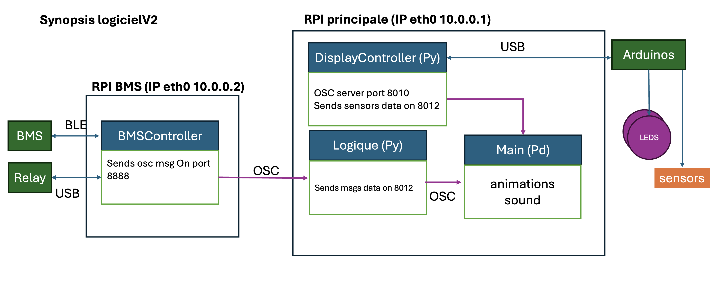
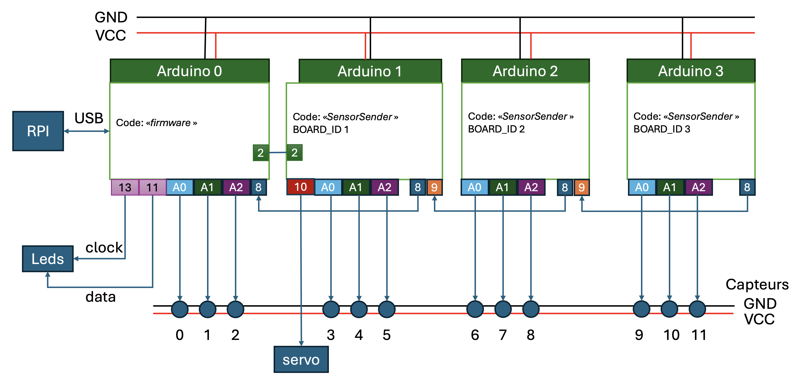

# Documentation

## Images disque rasbperry-Pi

### Backup d'une carte SD

Instructions pour macos, la commande `dd` fonctionnera sur Linux, mais il est nécessaire d'adapter la partie `diskutil` qui ne sert qu'à déterminer le nom du disque.

```bash
> diskutil list


/dev/disk9 (external, physical):
   #:                       TYPE NAME                    SIZE       IDENTIFIER
   0:     FDisk_partition_scheme                        *62.6 GB    disk9
   1:             Windows_FAT_32 bootfs                  536.9 MB   disk9s1
   2:                      Linux                         62.1 GB    disk9s2

# le disque à utiliser ici est le numéro 9
# ne pas oublier d'ajouter le 'r' avant disk9: disk9 -> /dev/rdisk9
# of: chemin pour créer l'image disque
sudo dd if=/dev/rdisk9 of=/Users/manueldeneu/Documents/dev/SolarDevice/Backups/bms.img bs=1m
# cette commande bloque le terminal jusqu'à la complétion de la copie
```

### Restauration d'une carte SD

Utiliser l'application [Raspberry-Pi Imager](https://www.raspberrypi.com/software) et

## Configuration

### Configuration des paramètres d'animation de puredata

Simple fichier texte qui se trouve dans le sous-répertoire `Pd`. Par défault il s'agit du fichier `config.txt` Pour connaitre le nom du fichier utilisé, voir dans `main.pd`, sous-patch `pd init`, objet `config`.
Ce fichier suit la syntaxe `CLE VALEUR;`

**Attention**: Ne pas oublier les `;` en fin de lignes -- même dans les commentaires!

Si une valeur attendue par puredata n'est pas présente dans le fichier de config, un message `config-search-error: symbol CLE`, où `CLE` est le nom du paramètre de configuration, apparaitra dans la console puredata.

## Messages OSC

### day-state

exemple pour lever de soleil à 6h et coucher à 22h

| Heure        |      Index     |
|----------------|--------------------|
|    6h-11h            |   0 |
|    11h-13h            |   1 |
|    13h-21h            |   2 |
|    21h-22h            |   3 |
|    22h-6h            |   4 |

### Météo

| Adresse        |      Arguments     |     Notes                                  |
|----------------|--------------------|--------------------------------------------|
| `/nebulosity`  | `[float, float]`   | nébulosité actuelle, nébulosité suivante   |
| `/day`         | `int`              |  jour/nuit                                 |

Note: la nébulosité s'exprime entre 0 (pas de nuages) et 1 (temps couvert)

### BMS

| Adresse        |      Arguments     |     Notes                                  |
|----------------|--------------------|--------------------------------------------|
| `/battery`     | `float`            | Pourcentage batterie   |
| `/powerinput`  | `float`            |  puissance en entrée en Watts |
| `/charging`  | `int`            |  en charge sur secteur |

### DisplayController

| Adresse        |      Arguments     |     Notes                                  |
|----------------|--------------------|--------------------------------------------|
| `/sensor`     | `[int, float]`      | capteur i: Vitesse en tour/sec   |

## Synopsis logiciels

[]

## Câblage Arduino

[]
